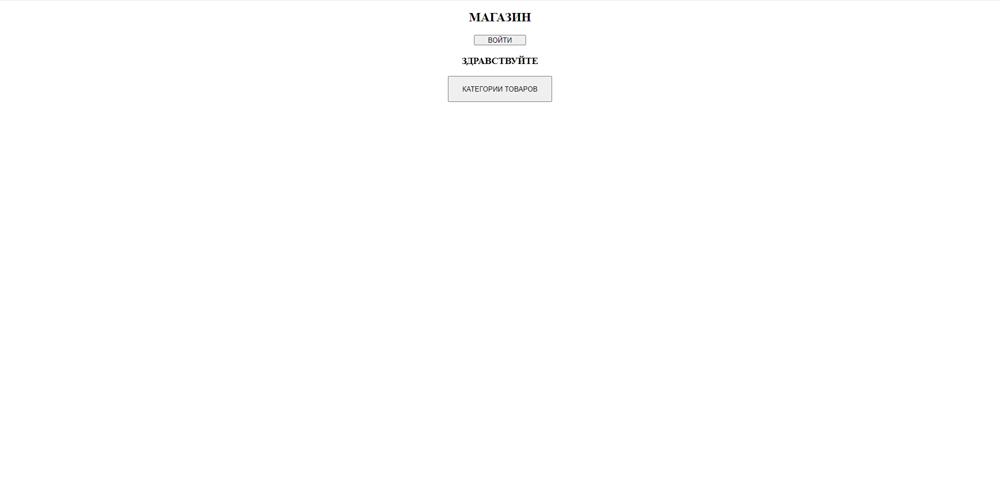
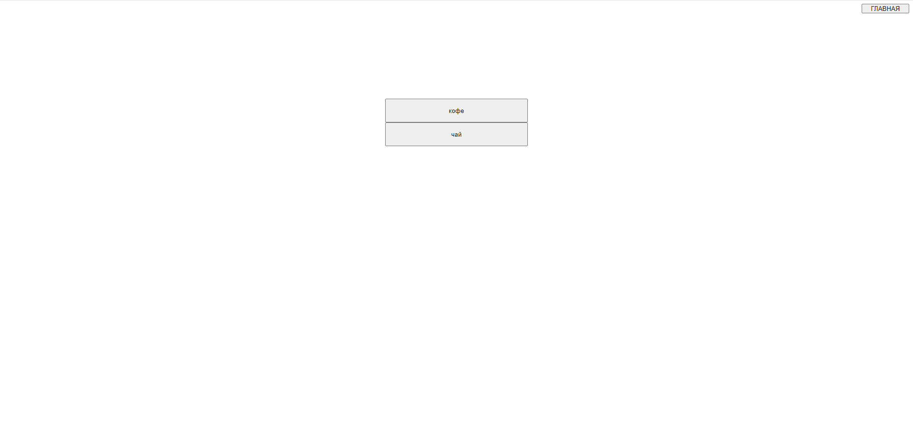
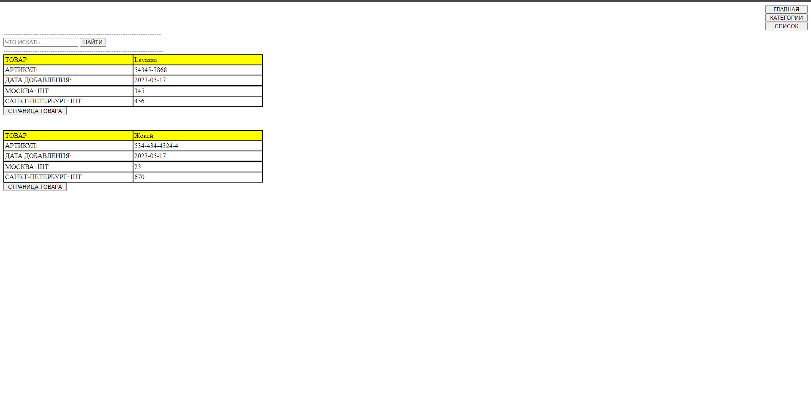
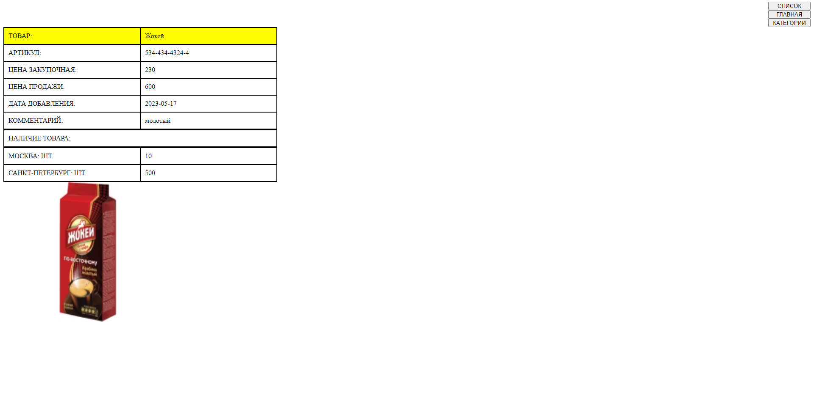
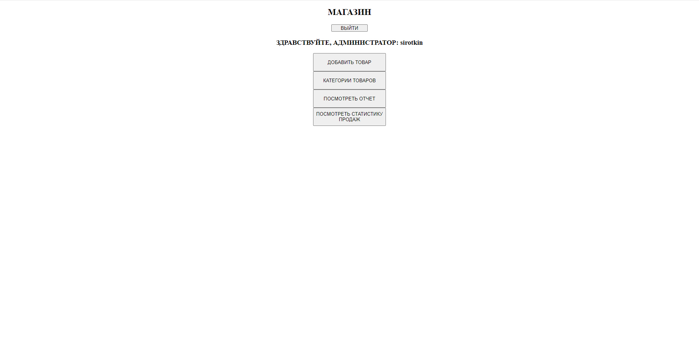
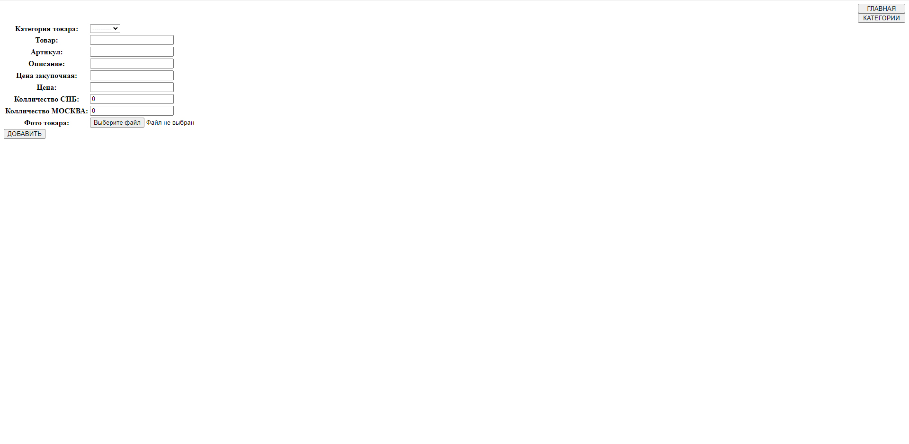
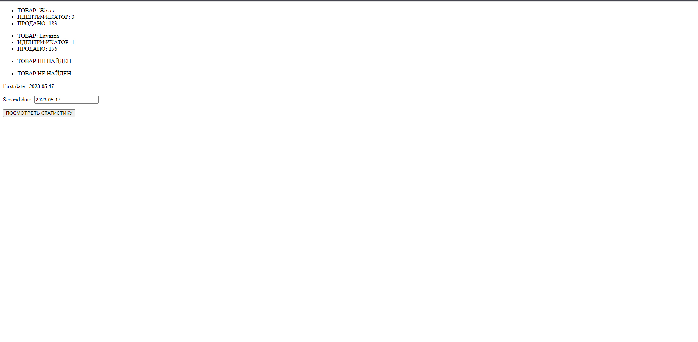
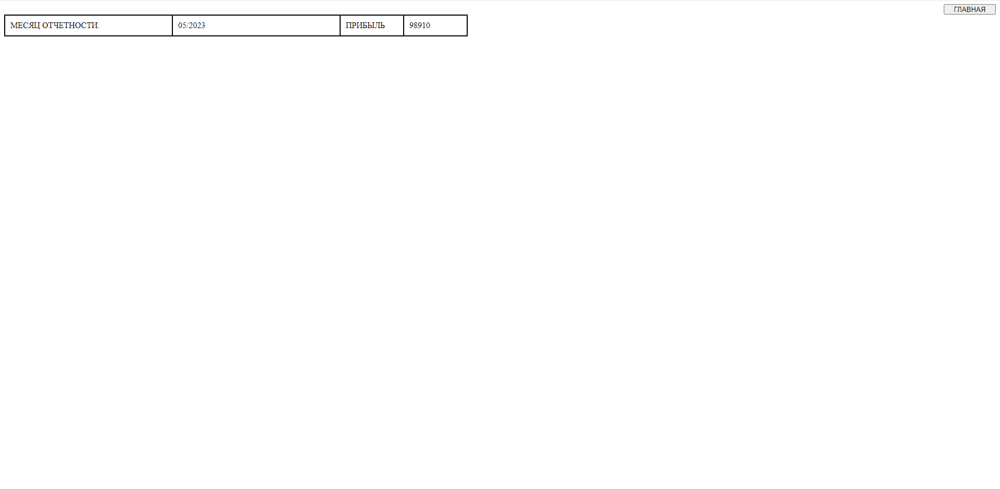
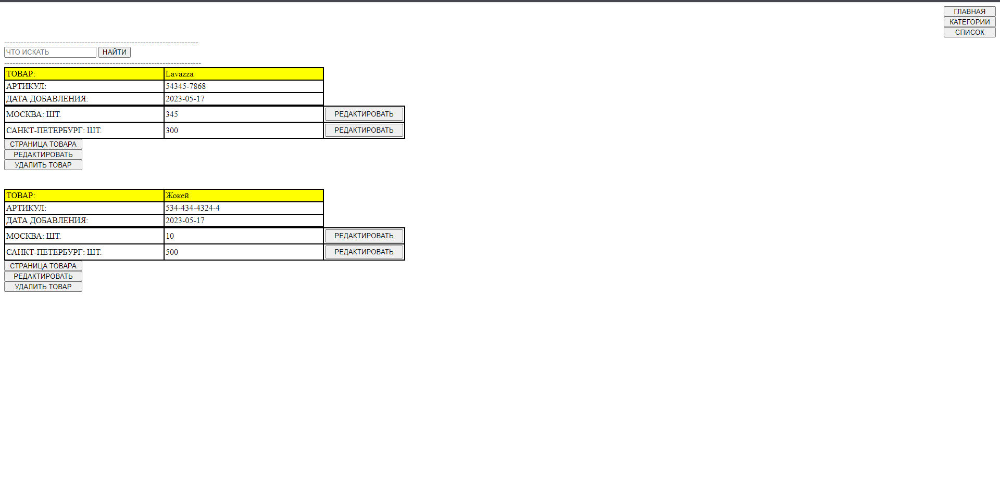

# warehouse app
Приложение для работы склада.

``выполните клонирование репозитория``\
git clone https://github.com/sirotkinnikolay/warehouse.git

``установите необходивые библиотеки из файла requirements.txt``\
pip install -r requirements.txt

``примените миграции``\
python manage.py makemigrations
python manage.py migrate

``зугрузите фикстуру для тестового запуска``\
python manage.py loaddata fixtures/category.json \
python manage.py loaddata fixtures/product.json

``создайте суперпользователя,  введите логин и пароль для администратора ``\
python manage.py createsuperuser

``запустите приложение``\
python manage.py runserver

``для входа на локальном сервере введите в адресную строку http://127.0.0.1:8000/ ``

``для входа в панель администратора введите в адресную строку http://127.0.0.1:8000/admin``

``введите логин и пароль созданный при создании суперпользователя ``

### Приложение предназначено для:
- ведения учета товаров на складах в нескольких городах
- подсчета прибыли за интервал времени
- просмотра статистики продаж
- просмотра покупателями наличия товаров на складе

## Покупатели могут
- просматривать наличие товаров на складах по категориям
## На главной странице 
- ###покупатель может
перейти к просмотру наличия товаров по 
категориям, просмотреть детальную страницу товара или войти как администратор

- ###администратор может

1. добавлять товары

2. добавлять категории
3. просматривать статистику продаж за выбранный интервал времени

4. просматривать отчетность по месяцам

5. просматривать товары по категориям, изменять их колличество на складах,
удалять товар, редактировать товар, просматривать детальную страницу товара
